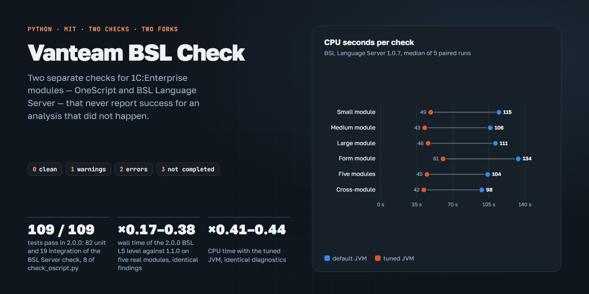

<h1 align="center">Vanteam BSL Check</h1>

<h4 align="center">Checks for 1C:Enterprise (BSL) modules in two separate commands — OneScript and BSL Language Server — with exit codes you can trust</h4>

<div align="center">
  <a href="LICENSE"></a>
  <a href="https://www.python.org/"></a>
  <a href="https://github.com/ivanbokhan84/OneScript/tree/v2.2.0-vanteam.2"></a>
  <a href="https://github.com/ivanbokhan84/bsl-language-server/releases/tag/v1.0.7-vanteam.1"></a>
  <a href="CHANGELOG.md"></a>
</div>
<br/>

<p align="center"><a href="https://ivanbokhan84.github.io/vanteam-bsl-check/"></a></p>

Project page with the test and measurement charts: **[ivanbokhan84.github.io/vanteam-bsl-check](https://ivanbokhan84.github.io/vanteam-bsl-check/)**.

Vanteam BSL Check bundles two standalone checkers for 1C modules, one per engine. Each engine has its own fork, and each checker is maintained with its engine; this repository pins released versions of both:

| Level | Command | Checker | Engine and fork |
|---|---|---|---|
| 1. OneScript | `tools/check_oscript.py` | Vanteam OneScript check | OneScript 2.2.0-vanteam.2, `oscript -checkall` — **[ivanbokhan84/OneScript](https://github.com/ivanbokhan84/OneScript)**, tag [`v2.2.0-vanteam.2`](https://github.com/ivanbokhan84/OneScript/tree/v2.2.0-vanteam.2) |
| 2. BSL Language Server | `tools/check_bsl.py` | VANTEAM BSL Server check 1.0.0, unchanged from its [release asset](https://github.com/ivanbokhan84/bsl-language-server/releases/tag/v1.0.7-vanteam.1) | BSL Language Server 1.0.7-vanteam.1 — **[ivanbokhan84/bsl-language-server](https://github.com/ivanbokhan84/bsl-language-server)**: persistent cache of the parsed platform syntax helper, `--target` |

Run both after every change to a module:

```shell
python tools/check_oscript.py path/to/Module.bsl          # 1. OneScript: syntax and code generator checks
python tools/check_bsl.py path/to/Module.bsl              # 2. BSL Language Server: diagnostics (--deep is accepted)
```

Both checkers refuse to report success when the analysis did not actually happen: a missing engine, a missing report, a module absent from the report, an unknown severity or a crashed rule end with a separate "check not completed" code instead of a green result.

Maintained by **Ivan Bokhan**.

## Features

Level 1, `check_oscript.py`:

* **Every error of a module in one run.** `oscript -checkall` runs once for all files and reports every syntax and code generator error of a module — wrong argument count for the module's own methods, a procedure used as a function, a duplicate method (with its line), labels — instead of stopping at the first one. Unknown names of the 1C global context (`Справочники`, `Документы`, other common modules) are listed, not treated as errors.
* **Code under `#Если Сервер` is checked too.** OneScript defines no 1C preprocessor symbols, so any OneScript check skips the body of `#Если Сервер Тогда`. `check_oscript.py` also checks a copy of every module that has `#Если`, with the directive lines blanked out (line numbers unchanged); errors found only there are marked `[ветка #Если]`.

Level 2, `check_bsl.py` (VANTEAM BSL Server check 1.0.0; full description in [docs/bsl-server-check/README.md](docs/bsl-server-check/README.md)):

* **BSL Language Server only.** OneScript is never called from here; `--deep` and `--all` are accepted for compatibility with older calls.
* **Fast engine start.** `tools/setup_bsl_server.py` installs the fork JAR (SHA-256 verified) outside the project, extracts it, trains and verifies an AppCDS archive, prepares a Russian-only syntax helper and the platform-context cache. On three real modules against the stock 1.0.7 engine: identical findings, wall time ×0.29–0.31, CPU ×0.25–0.30.
* **Several modules in one JVM.** Modules of one directory go to one analysis with several `--target`.
* **Honest results.** Exit code `3` means the check did not complete: no engine or Java 21+, a timeout, a JVM exit code other than 0 (an out-of-memory error included), a WARN/ERROR line of the engine log, no report or no module in it, an unknown severity, metadata of a dump not loaded.
* **Explicit analysis scope.** By default BSL LS sees the `.bsl`/`.os` files of the module's own directory; nested folders are left out. `--source-dir` sets a recursive context and the metadata root; `--standalone` checks the file alone.
* **Only new findings.** `bsl_new_findings.py` compares a module with its version in Git (default `HEAD`) and prints only the ERROR/WARN findings that appeared.
* **One analysis at a time** per project, `--json` for a machine-readable result.

## Requirements

| Component | Version | Notes |
|---|---|---|
| Python | 3.10+ | standard library only |
| OneScript | 2.2.0-vanteam.2 | for `check_oscript.py`; built from the [fork](https://github.com/ivanbokhan84/OneScript), see [OneScript](#onescript) |
| Java | 21+ | JDK for the BSL LS engine; a portable Temurin 21 can be fetched into `tools/jdk21` |
| BSL Language Server | 1.0.7-vanteam.1 | installed by `tools/setup_bsl_server.py` from the [fork release](https://github.com/ivanbokhan84/bsl-language-server/releases/tag/v1.0.7-vanteam.1), SHA-256 verified |
| Git | any recent | for `bsl_new_findings.py` |

Developed and tested on Windows 11.

## Installation

```shell
git clone -b release/2.0.0 https://github.com/ivanbokhan84/vanteam-bsl-check.git
cd vanteam-bsl-check
python scripts/fetch_dependencies.py --jdk               # optional: portable JDK 21 into tools/jdk21
python tools/setup_bsl_server.py --java tools/jdk21      # BSL LS engine, once per machine
python tools/setup_bsl_server.py --check                 # verify without changes
```

The engine is installed into `VANTEAM_BSL_HOME`, by default `%LOCALAPPDATA%\vanteam-bsl-server`: the JAR and its extracted layout, the AppCDS archive, the Russian-only syntax helper, the cache and `install.json` with the versions, SHA-256 and the JDK fingerprint. After a change of the JAR or the JDK the installer retrains the archive; `check_bsl.py` uses it only when the fingerprint matches. OneScript is built separately, see below.

## OneScript

`check_oscript.py` needs the OneScript build with `-checkall`. Binaries are not published; build it from the fork (.NET SDK 8+):

```shell
git clone -b v2.2.0-vanteam.2 https://github.com/ivanbokhan84/OneScript.git
cd OneScript
dotnet publish src/oscript/oscript.csproj -r win-x64 --self-contained -c Release -p:VersionPrefix=2.2.0 -p:VersionSuffix=vanteam.2 -p:PublishReadyToRun=true -o %LOCALAPPDATA%\Programs\OneScript-2.2.0-vanteam.2\bin
```

The checker looks for `VANTEAM_OSCRIPT`, then `%LOCALAPPDATA%\Programs\OneScript-2.2.0-vanteam.2\bin\oscript.exe`. Check: `oscript -version` prints `2.2.0-vanteam.2`.

Why the fork: on real 1C modules the stock `oscript -check` stops at the first unknown 1C name, so the code generator checks after it never run, and OneScript 1.9.4 sees nothing at all after it. The official 2.2.0 also takes a `#` inside a string of an inactive `#Если` branch for a directive. Measured on 76 modules of a 1C configuration: one `-checkall` run takes 2.4 s against 50–80 s for `-check` with a process per file; all 116 real modules are checked to the end against 10 with `-check`. Details are on the [fork's page](https://ivanbokhan84.github.io/OneScript/).

What OneScript does not check: the 1C compatibility mode. `СтрНайти`, `ТекущаяДата` and other 8.3 functions are accepted — BSL LS reports them. Names that exist neither in OneScript nor in 1C (`НижнийРегистр`, `Симв`) appear in the "Проверить вручную" list: look for a typo there.

## Usage

```shell
python tools/check_oscript.py path/to/Module.bsl              # level 1: one module
python tools/check_oscript.py path/to/CommonModules           # level 1: a folder in one run
python tools/check_oscript.py                                 # level 1: src, cf_source, release/cf_source
python tools/check_oscript.py path --quiet --symbols          # no OK lines; unknown names per file

python tools/check_bsl.py path/to/Module.bsl                  # level 2: BSL Language Server
python tools/check_bsl.py A/Module.bsl A/Other.bsl B/Module.bsl   # one JVM per scope, several --target
python tools/check_bsl.py path/to/Module.bsl --source-dir path/to/dump   # full configuration context
python tools/check_bsl.py path/to/Module.bsl --standalone     # the file alone
python tools/check_bsl.py path/to/Module.bsl --json           # the result as one JSON object

python tools/bsl_new_findings.py path/to/Module.bsl            # new findings against HEAD
python tools/bsl_new_findings.py path/to/Module.bsl main~3     # ... against any revision
```

### Exit codes

`check_oscript.py`

| Code | Meaning |
|---|---|
| `0` | no errors; unknown 1C names are not errors |
| `1` | errors: lines `ОШИБКА <file> стр N,M <text>` |
| `2` | a file could not be checked |
| `3` | OneScript 2.2.0-vanteam.2 not found |

`check_bsl.py` — the highest code of all modules

| Code | Meaning |
|---|---|
| `0` | no errors and no warnings |
| `1` | warnings only |
| `2` | errors: a BSL LS finding of level Error |
| `3` | the check did not complete; this is neither a success nor a list of findings |

INFO and HINT findings never raise the code.

## Configuration

* **Diagnostics** — [`tools/bsl_ls/.bsl-language-server.json`](tools/bsl_ls/.bsl-language-server.json), the project configuration; `tools/config/.bsl-language-server.json` is the checker's default with the same rules.
* **`VANTEAM_BSL_HOME`** — the engine installation, default `%LOCALAPPDATA%\vanteam-bsl-server`.
* **`VANTEAM_BSL_JAVA`** — Java 21+ for the engine; otherwise the JDK of the installation, `JAVA_HOME`, `PATH`.
* **`VANTEAM_BSL_XMX`** — JVM heap; default 512m, 1g for more than 150 modules or 20 MB of sources in the scope or checked modules over 4 MB.
* **`VANTEAM_BSL_TIMEOUT`** — the limit of one JVM run, seconds.
* **`BSL_LS_JAR`** — another fat JAR, without AppCDS; a path that does not exist is an error.
* **`VANTEAM_OSCRIPT`** — `oscript.exe` of 2.2.0-vanteam.2 for `check_oscript.py`.

## Tests

```shell
python -m unittest tools/tests/test_check_oscript.py -v
python -m unittest tools/tests/test_check_bsl.py tools/tests/test_integration.py -v
```

* `test_check_oscript.py` — 8 tests: 19 modules with known error lines in `tools/tests/fixtures/oscript_quality`, code under `#Если Сервер`, same-named methods in two branches, an unclosed `#Если`, a duplicate method line, a typo in the manual-check list, a missing engine. Seven need OneScript 2.2.0-vanteam.2.
* `test_check_bsl.py` and `test_integration.py` — the tests of VANTEAM BSL Server check 1.0.0: 81 unit tests and 19 integration tests on real Java 21 and the fork JAR.

Tests that need an engine are skipped when it is missing. A skipped integration test is not a pass. Run the BSL Server tests from a checkout whose path does not contain `oscript`: `test_no_oscript_is_started` looks for that word in the whole Java command line (see [CHANGELOG.md](CHANGELOG.md), known issues).

## Repository layout

```
tools/
  check_oscript.py              level 1: OneScript 2.2.0-vanteam.2 -checkall
  check_bsl.py                  level 2: VANTEAM BSL Server check 1.0.0 (BSL LS only)
  bsl_new_findings.py           new findings against a Git revision (BSL Server check)
  setup_bsl_server.py           installs and verifies the BSL LS engine (BSL Server check)
  config/.bsl-language-server.json    checker default configuration
  bsl_ls/.bsl-language-server.json    project configuration
  tests/                        tests and fixtures of both checkers
docs/bsl-server-check/          README, CHANGELOG, VERSION and SOURCE.json of the bundled BSL Server check
scripts/fetch_dependencies.py   optional portable JDK (and the fork JAR for BSL_LS_JAR)
DEPENDENCIES.json               pinned versions, URLs and SHA-256
```

The files of VANTEAM BSL Server check are copied unchanged from its release asset; [`docs/bsl-server-check/SOURCE.json`](docs/bsl-server-check/SOURCE.json) records the source and SHA-256 of each. Changes to them are made in the BSL Server project and come here with its next release.

## Versions

| Version | OneScript level | BSL LS level | Status |
|---|---|---|---|
| [2.0.0-rc.1](https://github.com/ivanbokhan84/vanteam-bsl-check/tree/release/2.0.0) | `check_oscript.py`, OneScript 2.2.0-vanteam.2 | VANTEAM BSL Server check 1.0.0, fork 1.0.7-vanteam.1 | release candidate |
| [1.2.0-rc.1](https://github.com/ivanbokhan84/vanteam-bsl-check/tree/release/1.2.0) | `check_oscript.py` | own wrapper, fork 1.0.7-vanteam.1 | superseded by 2.0.0-rc.1 |
| [1.1.0-rc.1](https://github.com/ivanbokhan84/vanteam-bsl-check/tree/release/1.1.0) | `check_bsl.py`, `oscript -check` | 1.0.7 | superseded |
| [1.0.0](https://github.com/ivanbokhan84/vanteam-bsl-check/tree/v1.0.0) | `check_bsl.py`, `oscript -check` | 0.29.0 | stable, independently reviewed, `main` |

See [CHANGELOG.md](CHANGELOG.md).

## Third-party software

Nothing third-party is stored in this repository. Downloaded on demand:

* BSL Language Server — LGPL-3.0-or-later, © the 1c-syntax contributors: the fork JAR [v1.0.7-vanteam.1](https://github.com/ivanbokhan84/bsl-language-server/releases/tag/v1.0.7-vanteam.1) with its source code in that repository, run as a separate program;
* Eclipse Temurin JDK — GPL-2.0 with the Classpath Exception, optional.

OneScript (MPL-2.0) is built separately from the fork [ivanbokhan84/OneScript](https://github.com/ivanbokhan84/OneScript), which keeps the upstream license and copyright notices.

## License

MIT — see [LICENSE](LICENSE).

## Credits

* [BSL Language Server](https://github.com/1c-syntax/bsl-language-server) by the 1c-syntax community; Vanteam fork: [ivanbokhan84/bsl-language-server](https://github.com/ivanbokhan84/bsl-language-server).
* [OneScript](https://github.com/EvilBeaver/OneScript) by EvilBeaver and the OneScript contributors; Vanteam fork: [ivanbokhan84/OneScript](https://github.com/ivanbokhan84/OneScript).
